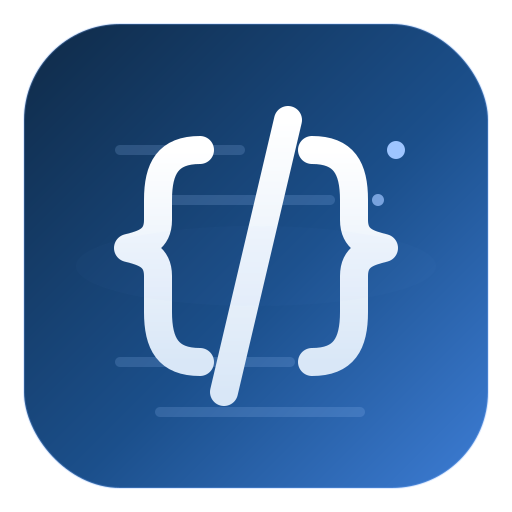

# code_snippet

[English](./README_en.md) | [简体中文](../README.md)

<p align="center">
  
</p>

A C++17 sample project that integrates via **git submodules**:

- [tomlplusplus](https://github.com/marzer/tomlplusplus) — TOML configuration parsing
- [fast-cpp-csv-parser](https://github.com/ben-strasser/fast-cpp-csv-parser) — CSV parsing
- [spdlog](https://github.com/gabime/spdlog) — logging

Each third-party library has a thin local wrapper (`Logger`, `ConfigParser`, CSV wrapper) under `src/<lib>/<lib>.{h,cpp}`, mirroring the layout of `third-part/`.

## Build & Run

```sh
git submodule update --init --recursive
cmake -S . -B build -DCMAKE_BUILD_TYPE=Debug
cmake --build build
./build/src/snippet_executable
```

Requires CMake >= 3.20.1 and a C++17 compiler. First-time clones need network access to fetch the submodules.

> Run the executable from the repository root — `src/main.cpp:18` resolves `config/config.toml` via `fs::current_path()`, and a non-root cwd silently breaks both config lookup and log path resolution.

On startup, logs are emitted to both the console and `log/<file>_YYYY-MM-DD.log` (default basename `spdlog`, overridable via config).

## Debugging

Open the project in VS Code and press **F5**. The `.vscode/` directory provides:

- `tasks.json` — build tasks (`cmake-configure`, `cmake-build`, `run`)
- `launch.json` — GDB debug configuration; auto-runs `cmake-build` before launch
- `c_cpp_properties.json` — IntelliSense configuration (C++17, GCC, include paths)

## Project Layout

| Path | Role |
|---|---|
| `src/main.cpp` | Entry point — loads config, initializes logger, parses CSV |
| `src/tomlplusplus/` | `ConfigParser` wrapper around tomlplusplus |
| `src/fast-cpp-csv-parser/` | Local wrapper around the CSV parser |
| `src/spdlog/` | `Logger` wrapper around spdlog; auto-rotates files into `log/` |
| `src/CMakeLists.txt` | Explicit list of wrapper sources (no globbing) |
| `third-part/` | Third-party dependencies (git submodules) |
| `third-part/CMakeLists.txt` | Pulls submodules via `add_subdirectory`; exposes the `fast_csv` interface library |
| `config/config.toml` | Runtime configuration (project metadata, data paths, logging) |
| `data/fast-cpp-csv-parser/in/ram.csv` | Sample CSV test data |
| `log/` | Runtime log directory (created on first run) |

## Dependencies

| Dependency | License | Role |
|---|---|---|
| [tomlplusplus](https://github.com/marzer/tomlplusplus) `v3.4.0` | MIT | Header-only TOML parser |
| [fast-cpp-csv-parser](https://github.com/ben-strasser/fast-cpp-csv-parser) (master HEAD) | BSD-3-Clause | Header-only CSV parser |
| [spdlog](https://github.com/gabime/spdlog) `v1.17.0` | MIT | Header-only logging library; built as a shared library (`SPDLOG_BUILD_SHARED=ON`) and linked via `spdlog::spdlog` |

All three are registered as git submodules in `.gitmodules` and consumed via `add_subdirectory` under `third-part/`. spdlog's build artifacts land in `build/third-part/spdlog/`, and the executable's `BUILD_RPATH` already points there, so `./build/src/snippet_executable` runs without `LD_LIBRARY_PATH`.

## Pinned Submodule Versions

| Commit SHA | Repo | Tag / Branch |
|---|---|---|
| `30172438cee64926dc41fdd9c11fb3ba5b2ba9de` | marzer/tomlplusplus | `v3.4.0` |
| `574a9fe4d323ba63416877a4a5fe59088d37aa34` | ben-strasser/fast-cpp-csv-parser | master HEAD |
| `79524ddd08a4ec981b7fea76afd08ee05f83755d` | gabime/spdlog | `v1.17.0` |

To bump a dependency: edit `.gitmodules` (URL), run `git submodule sync`, then inside the submodule run `git fetch --depth=1 origin <ref>` and `git checkout <ref>`, and finally commit the parent's new gitlink SHA.

## Configuration

Edit `config/config.toml` to change project metadata, data file paths, and logging settings:

```toml
[project]
name = "code_snippet"
version = "1.0.0"

[data]
fsv_test_file_in = "data/fast-cpp-csv-parser/in/ram.csv"
fsv_test_file_out = "data/fast-cpp-csv-parser/out/ram_out.csv"

[log]
dir   = "log"      # relative to the project root
file  = "spdlog"   # log file basename; _YYYY-MM-DD.log is appended daily
level = "info"     # trace|debug|info|warn|error|critical|off
```

CSV paths are joined to `project_root` at runtime. The logger reads the `[log]` section inside `Logger::init()` and registers the resulting logger as spdlog's default, so `spdlog::*` calls flow to both the console and the log file.

## Adding Code

- New `.cpp` files must be listed explicitly in `src/CMakeLists.txt:3-7` (no globbing).
- New third-party dependencies go in `third-part/CMakeLists.txt` via `add_subdirectory`, then are linked in `src/CMakeLists.txt:9-14`. Shared libraries also need the `BUILD_RPATH` update at `src/CMakeLists.txt:16-19`.
- To add a new wrapper for a third-party library, follow the existing pattern: create `src/<lib>/<lib>.{h,cpp}`, expose a small class (e.g. `ConfigParser`, `Logger`), and call its initializer from `main.cpp`.

## Branch Workflow

- `main` — release branch
- `dev` — integration branch; PRs merge `dev` into `main`
- Feature branches fork from `dev`
